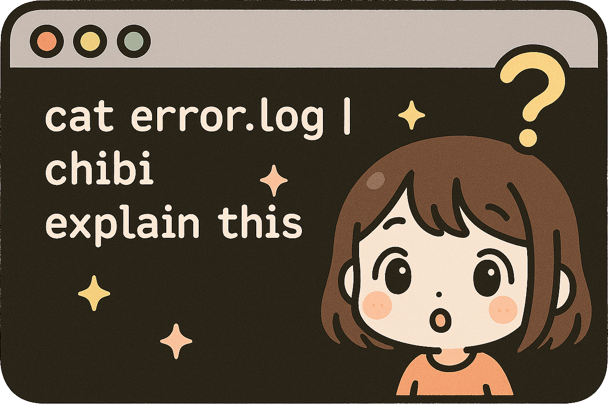

Chibi is a composable building block for LLM interactions — not an agent framework. It provides persistent context storage, a plugin and hook system that exposes the full request lifecycle, communication primitives for multi-agent coordination, and a programmable agentic loop.

Plugins have full access to chibi's lifecycle hooks — they can modify or replace core behaviours (like context assembly, prompt construction, tool filtering, permissions), spawn sub-agents with custom home directories, orchestrate fleets of chibis across different models and system prompts, and implement entirely new coordination patterns. The plugin layer has no ceiling.

**Early development — not yet stable.**

## Install

```bash
export CHIBI_API_KEY=your-openrouter-key
git clone https://github.com/emesal/chibi.git
cd chibi && just install
chibi nyaaa~
```

Requires [just](https://github.com/casey/just) and a Rust toolchain. Cargo fetches all dependencies automatically.

Get a free API key at [openrouter.ai](https://openrouter.ai/settings/keys) (no credit card needed), then:

## Use

```bash
chibi What is Rust?                       # Simple prompt
cat error.log | chibi "explain this"      # Pipe content
chibi -c project "Review this function"   # Named context
chibi -v "Read my Cargo.toml"             # Verbose (show tool use)
```

Contexts persist across invocations. Switch with `-c <name>`, list with `-L`.



## Configure

Persist your key and pick a model in `~/.chibi/config.toml`:

```toml
api_key = "your-key-here"
model = "anthropic/claude-sonnet-4"   # default: free-tier agentic preset
```

All fields are optional. See [Configuration](docs/configuration.md) for the full reference.

## Documentation

- [Getting Started](docs/getting-started.md) — Installation and first steps
- [Configuration](docs/configuration.md) — Full config reference
- [Contexts](docs/contexts.md) — Managing conversations
- [Plugins](docs/plugins.md) — Creating tools for the LLM
- [Hooks](docs/hooks.md) — Lifecycle event system
- [MCP Servers](docs/mcp.md) — Using MCP-compatible tool providers
- [Virtual File System](docs/vfs.md) — Sandboxed shared file space for contexts
- [Agentic Workflows](docs/agentic.md) — Autonomous processing
- [CLI Reference](docs/cli-reference.md) — All flags and commands
- [Images](docs/images.md) — Terminal image rendering
- [Markdown Themes](docs/markdown-themes.md) — Customising colour schemes
- [Transcript Format](docs/transcript-format.md) — JSONL format spec

Example plugins: [chibi-plugins](https://github.com/emesal/chibi-plugins)

## License

ISC

Make meow, not rawr
